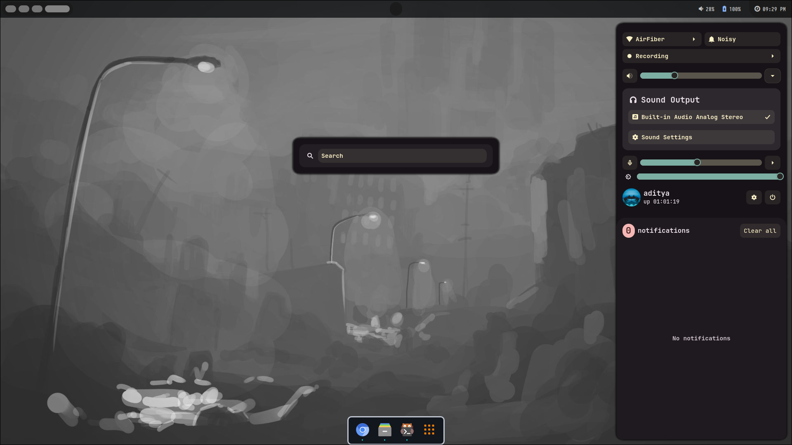
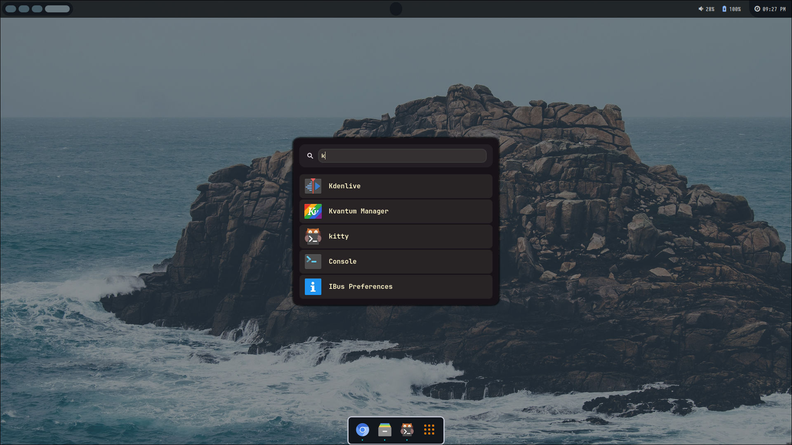
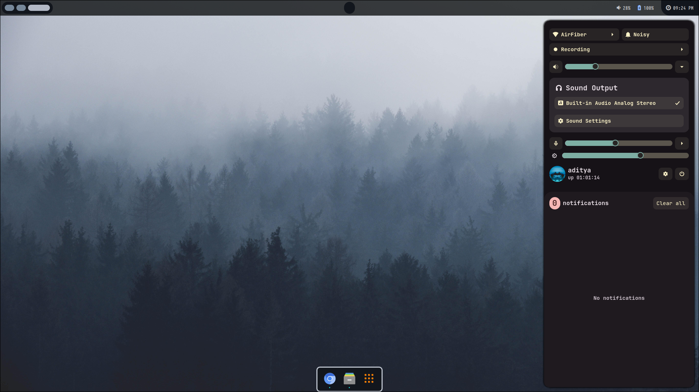
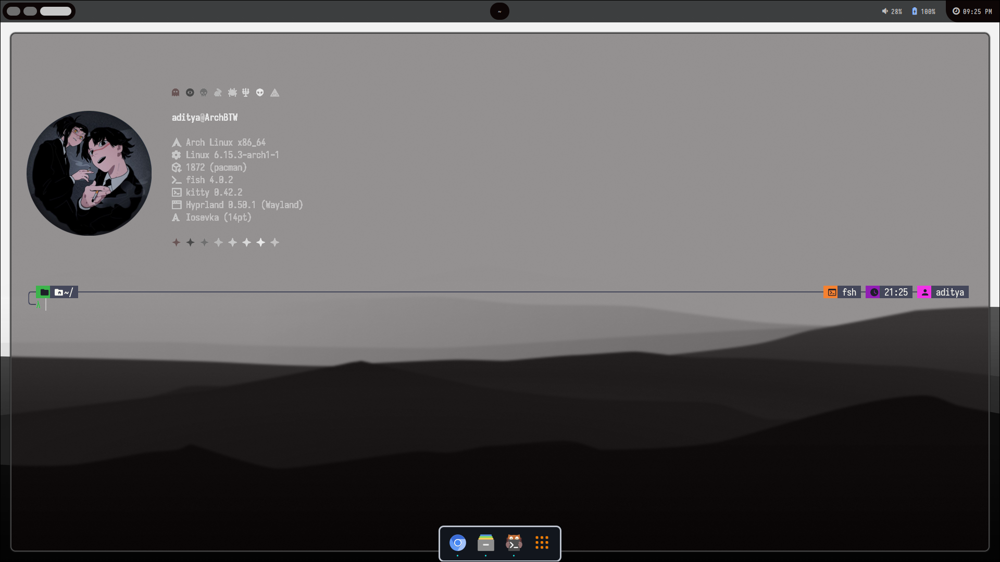

<div align="center">


# 【 dracx Dotz 】


A powerful, visually stunning Hyprland configuration built for **speed, workflow efficiency, and aesthetics**.


</div>
---

## Project Overview

**dracxDotz** is more than a configuration — in my opinion for me. Designed for **developers, and Linux enthusiasts**, it merges **aesthetic appeal** with **practical functionality**.

### Features at a Glance

- Lightning-fast workspace management
- Persistent workspaces 1–9 with dynamic app icons
- Integrated **Eww widgets** for system stats, weather, and battery
- Themeable **Waybar** with workspace-aware modules
- Customizable **Rofi launchers** for apps and wallpapers
- Advanced **pseudotiling, floating windows, and fullscreen toggles**
- Preconfigured scripts to enhance productivity

---

## Maintainer & Project Info

- **Maintainer:** xZepyx
- **Contact:** zepyxunderscore@gmail.com
- **Project Duration:** 2025–2040 (ongoing development)

### Latest Updates

- Added new **Waybar themes** with adaptive colors
- Integrated **`Alt + A` command** for automation
- Expanded **Eww widget suite** in `kernel-fault`
- Improved **workspace management scripts**
- Updated **documentation and screenshots** for clarity

---

## Screenshots & Visuals


### dracx

## Widgets
 

## Launcher
 

## ControlCenter
  

## Terminal
  


---

## Installation Guide

1. Clone repository
```
git clone https://github.com/Adityax3401x/dracxDotz.git ~/.config/dracxDotz
cd ~/.config/dracxDotz
```
2. Install dependencies
```
bash prerequisites.sh
```
3. Copy configs
```
cp -r hyprland/* ~/.config/hyprland/
```
4. Launch Hyprland
```
hyprland
```

---

## Customization & Tips

- Wallpapers: `~/.config/dracxDotz/wallpapers/`
- Waybar colors: `~/.config/dracxDotz/waybar/colors.css`
- Eww widgets: `~/.config/dracxDotz/eww/`
- Keybindings: `~/.config/hyprland/hyprland.conf`

Tips:
- Use pseudotiling for improved window management
- Assign workspace-specific apps
- Combine Rofi + Eww for a seamless aesthetic workflow

---

## Troubleshooting

- Waybar icons missing: Install FontAwesome or Material Icons
- Eww widgets missing: Run `eww daemon` before Hyprland
- Rofi launcher errors: Check `rofi/config.rasi` paths
- Hyprland crashes: Check `~/.local/share/hyprland.log`

---

## Acknowledgments

- [Hyprland](https://github.com/hyprwm/hyprland)
- [Ignis Project](https://github.com/ignis-sh/ignis)
- [Rofi](https://github.com/davatorium/rofi)
- [Eww](https://elkowar.github.io/eww/)
- [Waybar Project](https://github.com/Alexays/Waybar)
> Thanks to end4 and soromane for the spectral-horizon theme inspiration.

---

## License

© 2025–2040 xZepyx (zepyxunderscore@gmail.com)
Licensed under **GNU GPLv3** — free to use, modify, and redistribute.
Not me!!
---

